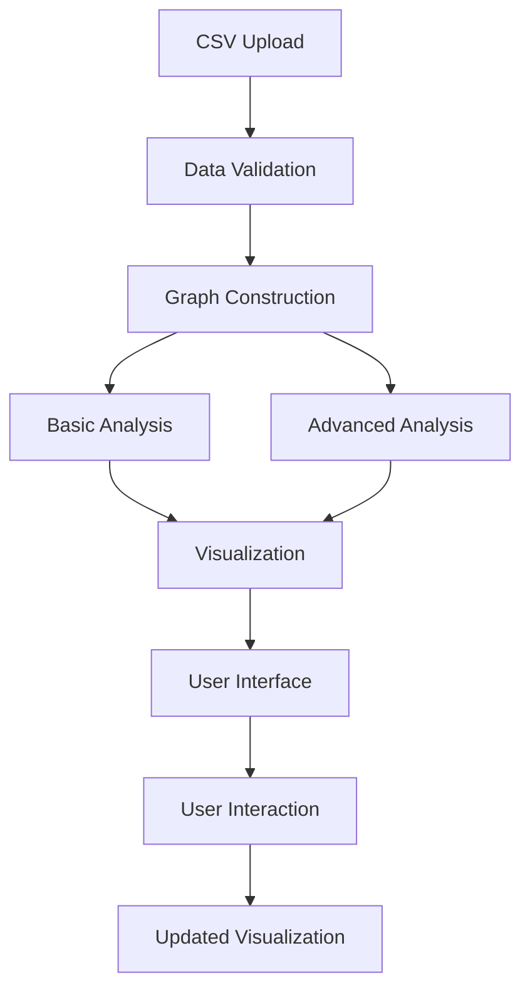

# 👨‍💻 ChainSense Development Guide

This document provides comprehensive information for developers working on ChainSense.

## 🏗️ Architecture Overview

ChainSense follows a modular architecture with clear separation of concerns:

```
ChainSense/
├── app.py                      # Main Streamlit application
├── data_processor.py           # Data loading and validation
├── graph_analyzer.py           # Network analysis and metrics
├── visualizer.py              # Visualization components
├── advanced_risk_analyzer.py   # ML-based risk analysis
├── config.ini                 # Configuration settings
├── requirements.txt           # Python dependencies
└── tests/                     # Test suite
    ├── test_data_processor.py
    ├── test_graph_analyzer.py
    └── test_visualizer.py
```

## 🔧 Development Environment Setup

### Prerequisites
- Python 3.8 or higher
- Git
- Virtual environment (recommended)

### Setup Steps
```bash
# Clone repository
git clone <repository-url>
cd ChainSense

# Create virtual environment
python -m venv venv
source venv/bin/activate  # Linux/Mac
# or
venv\Scripts\activate     # Windows

# Install dependencies
pip install -r requirements.txt

# Install development dependencies
pip install pytest black flake8 mypy

# Run tests
python test_modules.py
```

## 📁 Module Documentation

### `data_processor.py`
**Purpose**: Handle data input, validation, and graph construction

**Key Classes**:
- `SupplyChainData`: Main data processing class

**Key Methods**:
- `load_csv()`: Load and validate CSV data
- `build_graph()`: Convert data to NetworkX graph
- `validate_data()`: Ensure data quality
- `create_sample_data()`: Generate test data

### `graph_analyzer.py`
**Purpose**: Perform network analysis and calculate metrics

**Key Classes**:
- `GraphAnalyzer`: Core analysis functionality

**Key Methods**:
- `calculate_basic_metrics()`: Centrality and basic metrics
- `get_vulnerability_analysis()`: Identify weak points
- `get_top_nodes()`: Rank nodes by importance

### `visualizer.py`
**Purpose**: Create interactive and static visualizations

**Key Classes**:
- `SupplyChainVisualizer`: Visualization management

**Key Methods**:
- `create_interactive_graph()`: PyVis/vis.js visualization
- `create_network_overview()`: Plotly network view
- `_create_direct_html_fallback()`: Fallback visualization

### `advanced_risk_analyzer.py`
**Purpose**: Advanced ML-based risk analysis

**Key Classes**:
- `AdvancedRiskAnalyzer`: ML risk assessment

**Key Methods**:
- `calculate_advanced_risk_scores()`: Multi-dimensional risk
- `detect_anomalies()`: ML anomaly detection
- `simulate_disruption_scenarios()`: Scenario planning

## 🎨 UI Development Guidelines

### Streamlit Styling
- Use custom CSS in `app.py` for consistent styling
- Follow the gradient color scheme: `#667eea` to `#764ba2`
- Ensure dark text (`#2c3e50`) on white backgrounds
- Use modern card-based layouts with shadows

### Color Scheme
```css
--primary-color: #1f77b4;
--secondary-color: #ff7f0e;
--success-color: #2ca02c;
--warning-color: #d62728;
--background-color: #f8f9fa;
```

### Component Guidelines
- Use `st.columns()` for responsive layouts
- Implement progress indicators for long operations
- Provide clear error messages with recovery suggestions
- Include tooltips and help text for complex features

## 🧪 Testing Strategy

### Test Structure
- Unit tests for each module
- Integration tests for component interaction
- UI tests for Streamlit components (manual)
- Performance tests for large datasets

### Running Tests
```bash
# Run all tests
python test_modules.py

# Run specific module tests
python -m pytest tests/test_data_processor.py

# Run with coverage
python -m pytest --cov=. tests/
```

### Test Data
- Use `create_sample_data()` for consistent test datasets
- Test edge cases: empty data, malformed CSV, large networks
- Validate error handling and fallback mechanisms

## 🚀 Performance Optimization

### Data Processing
- Chunk large datasets for memory efficiency
- Use vectorized operations with pandas/numpy
- Implement lazy loading for large graphs

### Visualization
- Limit node count for interactive visualizations
- Use fallback methods for performance-critical scenarios
- Cache computed layouts and metrics

### Memory Management
- Clear large objects after processing
- Use generators for data streaming
- Monitor memory usage with large datasets

## 🔒 Error Handling

### Strategy
1. **Graceful Degradation**: Always provide fallback options
2. **User-Friendly Messages**: Clear, actionable error descriptions
3. **Logging**: Comprehensive logging for debugging
4. **Recovery**: Automatic recovery mechanisms where possible

### Common Error Patterns
```python
try:
    # Primary operation
    result = risky_operation()
except SpecificError as e:
    # Specific handling
    st.warning(f"Specific issue: {e}")
    result = fallback_operation()
except Exception as e:
    # General fallback
    st.error(f"Unexpected error: {e}")
    result = safe_default()
```

## 📊 Data Flow



## 🎯 Best Practices

### Code Style
- Follow PEP 8 formatting
- Use type hints for function parameters
- Document complex algorithms with docstrings
- Keep functions focused and single-purpose

### Documentation
- Update docstrings for all public methods
- Include examples in complex function documentation
- Update README.md for user-facing changes
- Maintain CHANGELOG.md for version tracking

### Version Control
- Use meaningful commit messages
- Create feature branches for new development
- Include tests with new features
- Update documentation with code changes

## 🔧 Configuration Management

### Settings
- Use `config.ini` for application settings
- Environment variables for deployment settings
- Session state for user preferences
- Constants for hardcoded values

### Deployment
- Test with different Python versions
- Verify dependencies are pinned appropriately
- Include setup scripts for easy deployment
- Document deployment requirements

## 🐛 Debugging Tips

### Common Issues
1. **PyVis Compatibility**: Use fallback visualization methods
2. **Memory Issues**: Monitor large graph processing
3. **Performance**: Profile code with `cProfile`
4. **UI Issues**: Test with different screen sizes

### Debug Tools
- Streamlit's built-in debugging
- Python debugger (`pdb`)
- Memory profiling (`memory_profiler`)
- Network analysis with NetworkX diagnostics

## 📈 Future Development

### Planned Features
- Export functionality (PDF, CSV)
- API integration capabilities
- Real-time data streaming
- Advanced ML models

### Technical Debt
- Improve test coverage
- Optimize large graph performance
- Enhance mobile responsiveness
- Add API documentation

## 🤝 Contributing

### Code Review Process
1. Create feature branch
2. Implement changes with tests
3. Update documentation
4. Submit pull request
5. Address review feedback
6. Merge after approval

### Release Process
1. Update version numbers
2. Update CHANGELOG.md
3. Run full test suite
4. Create release tag
5. Deploy to production

---

For questions or clarifications, please refer to the main README.md or create an issue in the repository.