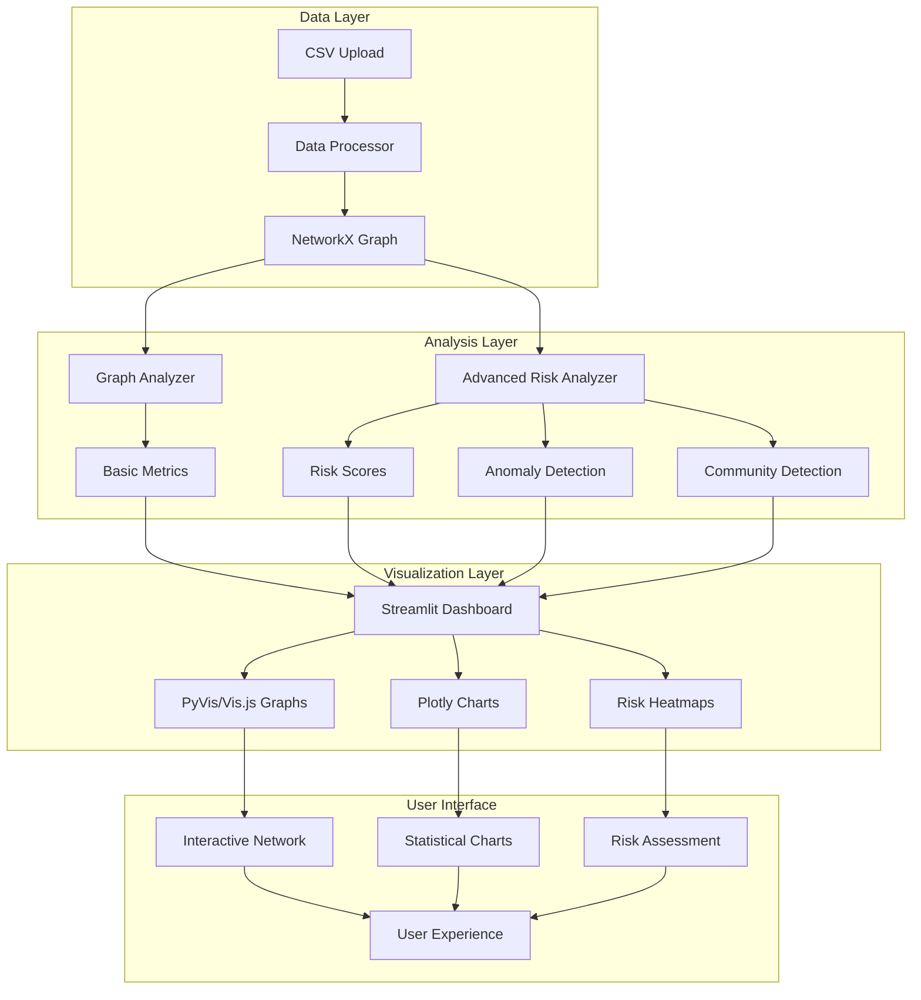

# 🔗 ChainSense - Supply Chain Risk Analyzer

<div align="center">

[](https://www.python.org/downloads/)
[](https://streamlit.io/)
[](LICENSE)
[](#)
[](#)
[](#)

**AI-powered graph insights for resilient supply chains**

*Transform your supply chain data into actionable intelligence with advanced network analysis and risk assessment*

[🚀 Quick Start](#quick-start) • [📖 Documentation](#documentation) • [🎯 Features](#features) • [🛠️ Installation](#installation) • [📊 Demo](#demo)

</div>

---

## 🌟 Overview

**ChainSense** is a comprehensive supply chain risk analysis platform that combines the power of graph theory, machine learning, and interactive visualization to help organizations:

- 🔍 **Identify vulnerabilities** in supply chain networks
- ⚡ **Predict disruption impacts** through scenario simulation
- 🛡️ **Build resilience** with AI-powered recommendations
- 📊 **Visualize complex relationships** with interactive network graphs
- 🎯 **Make data-driven decisions** for supply chain optimization
- 🔧 **Universal compatibility** with any CSV dataset structure

### 🚀 **NEW: Universal Dataset Compatibility**

ChainSense now automatically adapts to **ANY** CSV dataset structure! No more column mapping errors - our intelligent system detects relationships from your data automatically.

**Supported Mapping Strategies:**
- 🏭 **Supplier → Geographic Markets** (supplier + location data)
- 📦 **Supplier → Product Categories** (supplier + product/category data) 
- 🔄 **Custom Two-Column Mapping** (any two suitable columns)
- 🎯 **Smart Auto-Detection** (AI-powered relationship discovery)

## 🎯 Key Features

### 📊 Level 1 - Exploratory Dashboard
- **📁 Universal Data Upload**: Smart CSV/Excel processing that works with ANY dataset structure
- **📦 Multiple File Support**: Upload and combine multiple CSV/Excel files for comprehensive analysis
- **🔍 Intelligent Mapping**: Automatic relationship detection with 4 flexible strategies
- **🕸️ Interactive Network Visualization**: Dynamic graphs with PyVis and vis.js integration
- **📈 Network Metrics Analysis**: 
  - Degree & Betweenness Centrality
  - Network Density & Connectivity
  - Component Analysis
  - Node Classification (Suppliers, Customers, Intermediaries)
- **🎨 Professional UI**: Modern Streamlit interface with custom styling and error resilience

### 🎯 Level 2 - Advanced Risk Analysis
- **🔬 Multi-Dimensional Risk Scoring**:
  - Structural Risk (network position)
  - Operational Risk (transaction patterns) 
  - Concentration Risk (market dependency)
  - Connectivity Risk (isolation analysis)
- **🏘️ Community Detection**: Louvain algorithm for cluster identification
- **🚨 Anomaly Detection**: Isolation Forest & Local Outlier Factor
- **🛡️ Scenario Planning**: Disruption simulation and impact assessment
- **💡 AI Recommendations**: Automated resilience improvement suggestions
- **📊 Advanced Visualizations**: Risk heatmaps, correlation matrices, radar charts

## 🚀 Quick Start

### Option 1: Automated Setup (Recommended)
```bash
# Clone or download ChainSense
cd ChainSense

# Run automated setup (Windows)
setup.bat

# Start the application
run_app.bat
```

### Option 2: Manual Setup
```bash
# Install dependencies
pip install -r requirements.txt

# Run the application
streamlit run app.py
```

### Option 3: Virtual Environment
```bash
# Create virtual environment
python -m venv chainsense_env

# Activate environment
# Windows:
chainsense_env\Scripts\activate
# macOS/Linux:
source chainsense_env/bin/activate

# Install dependencies
pip install -r requirements.txt

# Run application
streamlit run app.py
```

### 🆕 New Features in v2.2.0

**Multiple File Upload Support:**
- Upload multiple CSV files to combine into a single analysis
- Upload Excel files (XLSX/XLS) in addition to CSV
- Mix and match file types (CSV + Excel) in a single upload

**How to Use Multiple Files:**
1. Select "Multiple Files" option in the upload section
2. Choose multiple CSV/Excel files from your system
3. Click "Process Files" to combine and analyze all data
4. ChainSense will automatically merge all files and detect relationships

## 📊 Demo

### Sample Data Analysis
1. **Load Sample Data**: Click "📊 Load Sample" in the sidebar
2. **Configure Analysis**: Choose layout (hierarchical/spring/circular) and metrics
3. **Run Analysis**: Select Level 1 (Basic) or Level 2 (Advanced)
4. **Explore Results**: Navigate through tabs to view insights

### 📁 Data Format Flexibility

**Traditional Format** (ideal):
```csv
supplier,customer,product,quantity,price,date
Supplier_A,Distributor_X,Product_Alpha,500,25.50,2024-01-15
Distributor_X,Retailer_1,Product_Alpha,100,35.00,2024-01-20
```

**Universal Compatibility** - Works with ANY structure:
```csv
# Product-focused data
Product type,SKU,supplier,Location,Manufacturing costs
Electronics,SKU001,TechCorp,Asia,15.50
Clothing,SKU002,FashionInc,Europe,8.20

# Geographic data  
Company,Region,Revenue,Lead time
GlobalSupply,North America,1M,14
EuroDistrib,Europe,800K,21

# Any two-column relationship
Source,Destination
Factory_A,Warehouse_B
Warehouse_B,Store_C
```

**📁 Multiple File Support:**
- Upload multiple CSV files that will be automatically combined
- Upload Excel files (XLSX/XLS) with supply chain data
- Mix different file formats in a single analysis

**✨ ChainSense automatically detects the best relationship structure from your data!**

## 🛠️ Installation

### System Requirements
- **Python**: 3.8 or higher
- **Operating System**: Windows, macOS, Linux
- **Memory**: 4GB RAM minimum, 8GB recommended
- **Storage**: 1GB free space

### Dependencies
```
streamlit==1.28.1          # Web framework
pandas==2.1.3              # Data manipulation
networkx==3.2.1             # Graph analysis
pyvis==0.3.2                # Interactive visualization
plotly==5.17.0              # Advanced charting
scikit-learn==1.3.2         # Machine learning
numpy==1.25.2               # Numerical computing
matplotlib==3.8.2           # Static plotting
seaborn==0.13.0             # Statistical visualization
python-louvain==0.16        # Community detection
```

## 📖 Documentation

### Architecture Overview



### Core Modules

#### 🗂️ `data_processor.py`
- **Universal CSV data loading** with intelligent column detection
- **Flexible relationship mapping** with 4 automatic strategies
- **NetworkX graph construction** with robust error handling
- **Smart node classification** (suppliers, customers, intermediaries)
- **Sample data generation** for testing and demonstration
- **Auto-detection algorithms** for any dataset structure

#### 📊 `graph_analyzer.py`
- Basic network metrics calculation
- Centrality analysis (degree, betweenness, closeness)
- Community detection algorithms
- Vulnerability assessment

#### 🎨 `visualizer.py`
- **Multi-backend visualization** with PyVis/vis.js integration
- **Intelligent fallback system** for maximum compatibility
- **Advanced chart creation** with Plotly
- **Risk heatmap generation** with color-coded severity
- **Error-resilient rendering** with automatic backup methods

#### 🔬 `advanced_risk_analyzer.py`
- Multi-dimensional risk scoring
- Scenario simulation and impact assessment
- Anomaly detection algorithms
- Resilience recommendations

#### 🖥️ `app.py`
- **Universal dataset compatibility** with smart column mapping interface
- **Professional Streamlit application** with modern UI design
- **Flexible tab navigation** and intuitive controls
- **Robust session state management** with error recovery
- **Responsive design** with professional CSS styling
- **Multi-strategy data processing** for any CSV structure

## 🎨 User Interface

### Dashboard Tabs

1. **📊 Data Overview**: Dataset statistics and node type distribution
2. **🕸️ Graph Visualization**: Interactive network with layout options
3. **📈 Risk Metrics**: Centrality analysis and risk assessment
4. **🔍 Advanced Analysis**: Community detection and anomaly identification
5. **🛡️ Scenario Planning**: Disruption simulation and recommendations

### Styling Features
- 🎨 Modern gradient design with professional color scheme
- 📱 Responsive layout for different screen sizes
- 🎯 Interactive controls with hover effects
- 📊 Color-coded risk levels (green/orange/red)
- 🏷️ Intuitive legends and tooltips

## 🔧 Advanced Configuration

### Layout Options
- **Spring Layout**: Natural force-directed positioning
- **Hierarchical Layout**: Directed flow visualization (best for DAGs)
- **Circular Layout**: Circular node arrangement

### Node Sizing Metrics
- **Degree Centrality**: Size by connection count
- **Betweenness Centrality**: Size by bottleneck importance
- **PageRank**: Size by network influence
- **Risk Score**: Size by calculated risk level

### Analysis Levels
- **Level 1 (Basic)**: Essential metrics and visualization
- **Level 2 (Advanced)**: Full AI analysis with ML algorithms

## 🚨 Troubleshooting

### Common Issues

#### PyVis Visualization Errors
- **Issue**: `'dict' object has no attribute 'physics'`
- **Solution**: Automatic fallback to vis.js direct implementation
- **Result**: Enhanced visualization with better controls

#### Data Upload Problems
- **Issue**: CSV format not recognized or column mapping errors
- **Solution**: ChainSense now supports ANY dataset structure!
  - Use **Smart Auto-Detection** for automatic relationship discovery
  - Try **Geographic Markets** mapping (supplier + location)
  - Try **Product Categories** mapping (supplier + product/category)
  - Use **Custom Two-Column** mapping for any two suitable columns
- **Alternative**: Use "Load Sample Data" to test functionality

#### CSV Parsing Errors
- **Issue**: "Error tokenizing data. C error: Expected X fields in line Y, saw Z"
- **Solution**: ChainSense now automatically handles malformed CSV files
  - Skips problematic rows while preserving valid data
  - Provides warning messages about skipped data
  - Continues processing even with formatting issues
- **Prevention**: Ensure consistent column counts in your CSV files

#### Universal Compatibility Features
- ✨ **No more "Missing required column" errors**
- 🔍 **Intelligent column detection** for any CSV structure
- 🔄 **Multiple mapping strategies** to fit your data
- 🤖 **AI-powered relationship discovery** from any dataset

#### Performance Issues
- **Issue**: Slow analysis on large networks
- **Recommendation**: Start with Level 1 analysis for networks >1000 nodes
- **Optimization**: Use hierarchical layout for better performance

### Error Recovery
- 🔄 Automatic fallback mechanisms for visualization failures
- 🛡️ Graceful error handling with user-friendly messages
- 📊 Multiple visualization backends (PyVis → vis.js → matplotlib)
- 📁 Robust CSV/Excel parsing with automatic recovery from malformed files

## 🤝 Contributing

We welcome contributions! Please follow these guidelines:

1. **Fork** the repository
2. **Create** a feature branch (`git checkout -b feature/AmazingFeature`)
3. **Commit** your changes (`git commit -m 'Add AmazingFeature'`)
4. **Push** to the branch (`git push origin feature/AmazingFeature`)
5. **Open** a Pull Request

### Development Setup
```bash
# Clone repository
git clone https://github.com/yourusername/ChainSense.git
cd ChainSense

# Install development dependencies
pip install -r requirements.txt
pip install pytest black flake8

# Run tests
python test_modules.py

# Run application
streamlit run app.py
```

## 📝 Version History

### v2.2.0 - Multiple File & Excel Support (Latest)
- ✨ **NEW**: Multiple CSV file upload support
- 📊 **NEW**: Excel file support (XLSX/XLS)
- 🔧 **NEW**: Mix and match file types in single upload
- 🔄 **NEW**: Automatic file combination and analysis
- 🛡️ **Enhanced**: Improved error handling for file uploads

### v2.1.0 - Universal Dataset Compatibility
- ✨ **NEW**: Universal CSV dataset compatibility
- 🔍 **Smart Auto-Detection**: Intelligent relationship discovery
- 📋 **4 Mapping Strategies**: Geographic, Product, Custom, Auto-detection
- 🛡️ **Enhanced Error Handling**: Robust null-checking and fallbacks
- 🔧 **Improved Data Processing**: Works with ANY column structure
- 🎨 **UI Enhancements**: Better user guidance and error messages

### v2.0.0 - Advanced Risk Analysis
- 🔍 Multi-dimensional risk scoring system
- 🏠 Community detection algorithms
- 🚨 Anomaly detection with ML
- 📊 Scenario planning and simulation
- 📈 Advanced visualization features

### v1.0.0 - Core Network Analysis
- 🕸️ Interactive graph visualization
- 📈 Basic network metrics
- 📊 Centrality analysis
- 🎨 Professional UI design

## 📄 License

This project is licensed under the MIT License - see the [LICENSE](LICENSE) file for details.

## 🙏 Acknowledgments

- **NetworkX** team for excellent graph analysis capabilities
- **Streamlit** for the amazing web framework
- **PyVis** and **vis.js** for interactive visualizations
- **Plotly** for advanced charting capabilities
- **scikit-learn** for machine learning algorithms

## 📞 Support

For questions, issues, or feature requests:

- 📧 **Email**: support@chainsense.com
- 🐛 **Issues**: [GitHub Issues](https://github.com/yourusername/ChainSense/issues)
- 📚 **Documentation**: [Wiki](https://github.com/yourusername/ChainSense/wiki)
- 💬 **Discussions**: [GitHub Discussions](https://github.com/yourusername/ChainSense/discussions)

---

<div align="center">

**Made with ❤️ for supply chain professionals worldwide**

*ChainSense - Transforming complexity into clarity*

</div>